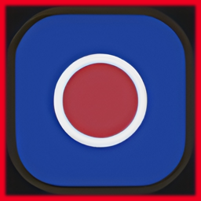

<h1 tabindex="-1" class="heading-element" dir="auto">
    
    Localview-Highlight
</h1>

[)](https://github.com/L0Lock/Autokey-Highlight/blob/master/LICENSE) ) 

-----

Toggles a border in the viewport based on local state, with customizable color and width. It's a fork of https://github.com/Lauloque/Autokey-Highlight and the Kofi link goes to the creator of the original addon. 

