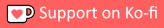

<h1 tabindex="-1" class="heading-element" dir="auto">
    
    Autokey-Highlight
</h1>

  

-----

Toggles a border in the viewport based on autokey state, with customizable color and width.

## Installation

You can download the extension either from Blender's GUI, or from [its Blender Extension webpage](https://extensions.blender.org/add-ons/autokey-highlight/), or from [this repository's releases page](https://github.com/L0Lock/Autokey-Highlight/releases).

The installation process is well explained by Blender's official extensions platform documentation:

[About — Blender Extensions](https://extensions.blender.org/about/)
